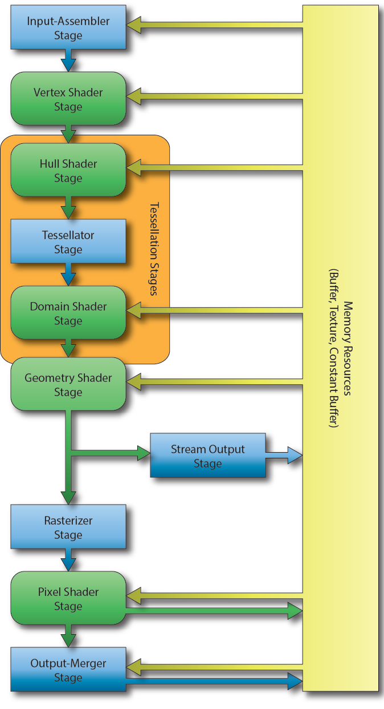

[[graphics]] [[directx12]] [[render]]
*Graphics Pipeline* состоит из нескольких стадий. Какие стадии фиксированные это значит управляются только функциями API. Другие стадии программируемые с помощью специальных программ (shader).

[[DirectX 12]]